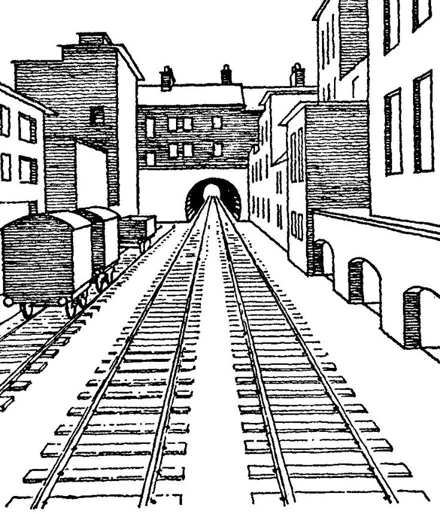
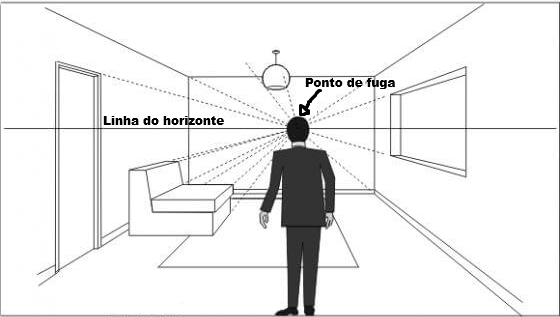

## PERSPECTIVA

A perspectiva vem do fato de que duas retas em paralelo tendem a se encontrar conforme se afastam. Isso acontece porque aos olhos do observador a distância entre as retas fica menor quanto mais distante ela está.

Assim como um objeto fica visualmente menor conforme se afasta da nossa visão, as distâncias entre objetos também ficam visualmente menores conforme se afastam. Perceba que na imagem abaixo as linhas do trem estão com um afastamento de 1m (exemplo) umas das outras em toda sua extensão, porém esse '1m' de distância vai parecendo cada vez menor conforme a linha se afasta da nossa visão.

>[Link](https://)
>
>data

#### LINHA DO HORIZONTE

A linha do horizonte é uma linha que fica aos nível dos olhos do observador (ou da câmera). Ela é importante porque todos os pontos de fuga sempre ficam nela (exceto quando há 3 pontos de fuga na imagem, 1 sempre ficará acima ou abaixo).

#### PONTO DE FUGA

É onde as retas paralelas se encontram. Sempre ficam localizados exatamente na linha do horizonte (exceto em figuras com 3 pontos) e podem estar em qualquer lugar na extensão da linha do horizonte.

Desenhos podem ter 1, 2 ou 3 pontos de fuga. Com 1 ponto de fuga é ideal para desenhar um objeto com uma das faces completamente paralela ao seus olhos.

Para desenhar objetos "em quina" é sempre melhor utilizar 2 pontos de fuga.

Para desenhos extremos, onde a sensação de extrema altura ou profundidade é importante, o ideal é utilizar 3 pontos de fuga.

