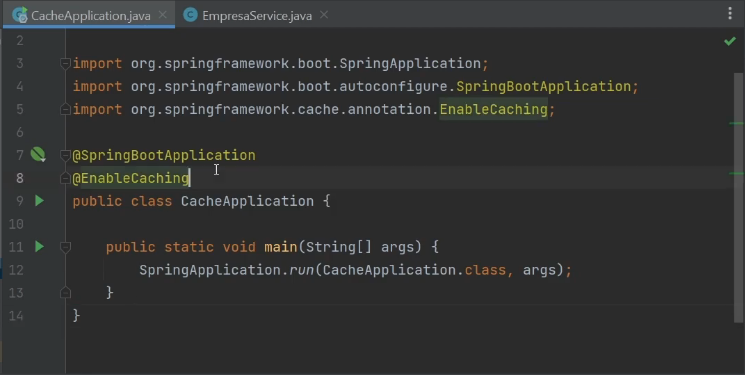
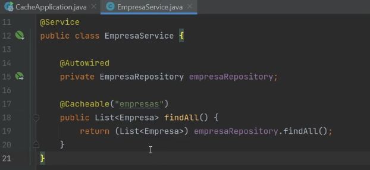
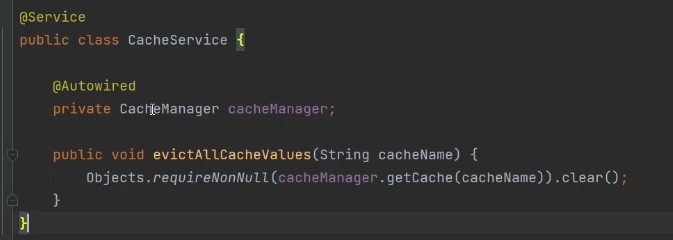
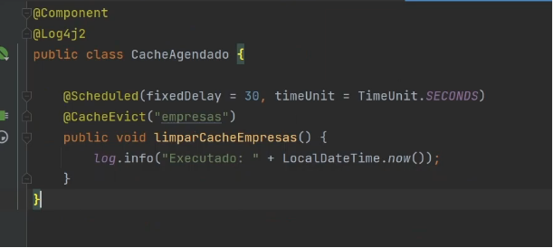

## Spring cache + redis

>[Link](https://youtu.be/eGRW5E4KENM?list=PL0D5C4QG6iBpTgwkzmGfp68hcKm8AER8s)
>
>30/06/2026

#### O que redis?

O Redis é um banco de dados cache do tipo chave/valor que guarda os dados na memória ram. Por estar na memória ram e não precisar ser recarregado, sua velocidade é extremamente superior em relação as consultas à bancos de dados normais.

#### Bibliotecas
Vamos utilizar a biblioteca `Spring Cache Abstraction`.

#### Anotações

É necessário inserir o `@EnableCacehing` na sua classe main (Application) responsável por dar o "run" no seu projeto.

Dentro do método do service que você irá cachear inserir uma anotação `@Cacheable("nome_da_chave")`

#### Criando um CacheService

Ao criar um CacheService é necessário injetar o CacheManager. Sempre que o método evictAllCacheValues for chamado o cache será limpado.

#### Limpando com scheduler
Podemos limpar com um scheduler e fixar um valor de 30 segundos. A anotação @CacheEvict("") serve para informar que o cache será limpo, não sendo necessário implementar na mão a limpeza do cache. Apenas a anotação já é suficiente.

Lembrando que para o scheduler funcionar é necessário inserir a anotação @EnableScheduling no main (Application).

#### @CachePut
O cacheput é uma forma de garantirmos que uma determinada entidade será atualizada no banco de dados, e que o os dados no cache sejam atualizados sem que seja necessário fazer um find novamente.

Isso é particularmente útil quando indexamos por entidade, ao invés de uma lista de entidades.

