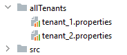

<div align='justify'>

## MULTI TENANT

>[baeldung.com](https://www.baeldung.com/multitenancy-with-spring-data-jpa)
>
>11 julho de 2024

Multi tenant permite que uma mesma aplicação possa utilizar diferentes bancos de dados ao mesmo tempo.

A classe `AbstractRoutingDataSource` determina o banco de dados para cada tenant

```java
public class MultitenantDataSource extends AbstractRoutingDataSource {

    @Override
    protected String determineCurrentLookupKey() {
        return TenantContext.getCurrentTenant();
    }
}
```

A classe `TenantContext` guarda o tenant atual para cada request.

```java
public class TenantContext {

    private static final ThreadLocal<String> CURRENT_TENANT = new ThreadLocal<>();

    public static String getCurrentTenant() {
        return CURRENT_TENANT.get();
    }

    public static void setCurrentTenant(String tenant) {
        CURRENT_TENANT.set(tenant);
    }
}
```

A classe `TenantFilter` é o filtro que irá resgatar o tenant de dentro do cabeçalho da requisição. É necessário definir no frontend um cabeçalho denominado "X-TenantID" para cada requisição.

```java
@Component
@Order(1)
class TenantFilter implements Filter {

    @Override
    public void doFilter(ServletRequest request, ServletResponse response,
      FilterChain chain) throws IOException, ServletException {

        HttpServletRequest req = (HttpServletRequest) request;
        String tenantName = req.getHeader("X-TenantID");
        TenantContext.setCurrentTenant(tenantName);

        try {
            chain.doFilter(request, response);
        } finally {
            TenantContext.setCurrentTenant("");
        }
    }
}
```

É necessário criar um arquivo properties para cada tenant dentro de uma pasta allTeants. Veja:



```
name=tenant_1
datasource.url=jdbc:postgresql://localhost:5432/tenant1
datasource.username=postgres
datasource.password=123456
datasource.driver-class-name=org.postgresql.Driver
```
e
```
name=tenant_2
datasource.url=jdbc:postgresql://localhost:5432/tenant2
datasource.username=postgres
datasource.password=123456
datasource.driver-class-name=org.postgresql.Driver
```

Por fim criamos uma classe de configuração que irá ler os properties:

```java
@Configuration
public class MultitenantConfiguration {

    @Value("${defaultTenant}")
    private String defaultTenant;

    @Bean
    @ConfigurationProperties(prefix = "tenants")
    public DataSource dataSource() {
        File[] files = Paths.get("allTenants").toFile().listFiles();
        Map<Object, Object> resolvedDataSources = new HashMap<>();

        for (File propertyFile : files) {
            Properties tenantProperties = new Properties();
            DataSourceBuilder dataSourceBuilder = DataSourceBuilder.create();

            try {
                tenantProperties.load(new FileInputStream(propertyFile));
                String tenantId = tenantProperties.getProperty("name");

                dataSourceBuilder.driverClassName(tenantProperties.getProperty("datasource.driver-class-name"));
                dataSourceBuilder.username(tenantProperties.getProperty("datasource.username"));
                dataSourceBuilder.password(tenantProperties.getProperty("datasource.password"));
                dataSourceBuilder.url(tenantProperties.getProperty("datasource.url"));
                resolvedDataSources.put(tenantId, dataSourceBuilder.build());
            } catch (IOException exp) {
                throw new RuntimeException("Problem in tenant datasource:" + exp);
            }
        }

        AbstractRoutingDataSource dataSource = new MultitenantDataSource();
        dataSource.setDefaultTargetDataSource(resolvedDataSources.get(defaultTenant));
        dataSource.setTargetDataSources(resolvedDataSources);

        dataSource.afterPropertiesSet();
        return dataSource;
    }

}
```

Perceba que a função carrega todos os arquivos dentro de allTenants. Para cada arquivo tenant.propertie ele irá criar um `datasource` a partir do `DataSourceBuilder`.


</div>